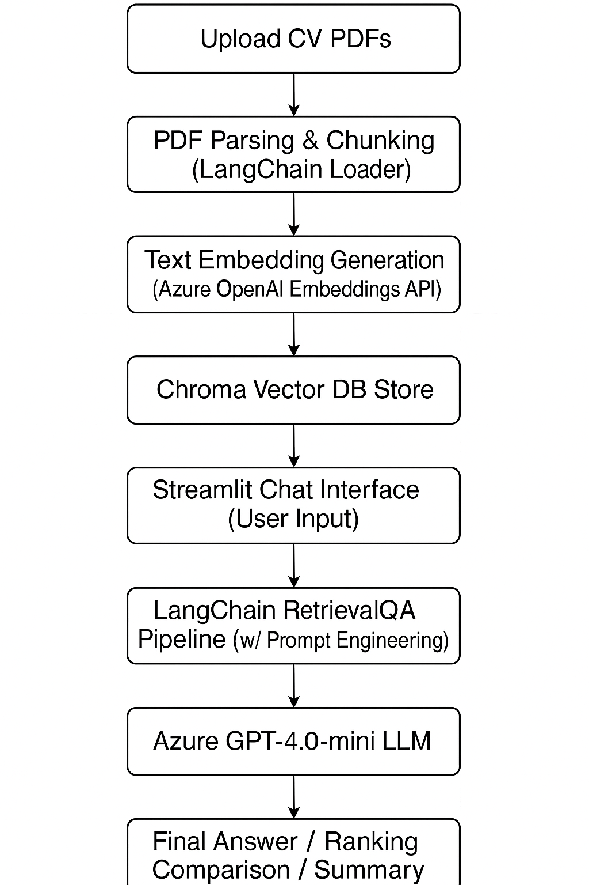

# 📄 CV Filtering Chatbot using Azure OpenAI & LangChain

This project is a powerful and interactive CV (Resume) filtering assistant built with **Streamlit**, **Azure OpenAI GPT-4.0-mini**, and **LangChain**.

It enables HR professionals, recruiters, and hiring managers to upload multiple CVs in PDF format, process them into vector embeddings, and ask natural language questions to extract, summarize, compare, and rank candidates based on roles, skills, experience, and more.

---

## 🚀 Features

- 🔍 **Upload & Process Multiple CVs (PDFs)** with automated chunking and metadata tagging  
- 💬 **Conversational QA Interface** powered by Azure GPT-4.0-mini for querying CVs  
- 📌 **Advanced Prompt Engineering** with strict rules to:
  - Avoid hallucinations  
  - Keep CVs strictly separate per individual  
  - Validate job roles and suggest similar ones  
- 🧠 **Smart Ranking**: Identify and rank the most suitable candidates for specific roles  
- 📊 **Side-by-Side Comparison** between individuals' experiences, skills, or education  
- ♻️ **Session Memory** for contextual multi-turn conversations  
- 🌐 **Built with LangChain, Chroma Vector DB, and Azure OpenAI**

---

## 🧠 Use Case Examples

- “Who has Python and machine learning skills?”  
- “Compare Ahmed and Salma’s education.”  
- “Find someone suitable for a Data Analyst role.”  
- “Who is the most experienced project manager?”  
- “Show all candidates with AWS certification.”

---

## 🛠 Tech Stack

| Layer               | Technology                            |
|---------------------|----------------------------------------|
| Frontend            | Streamlit                             |
| LLM                 | Azure OpenAI GPT-4.0-mini             |
| Embeddings          | Azure OpenAI Embeddings               |
| Vector Store        | Chroma                                |
| Document Parsing    | PyPDFLoader (LangChain)               |
| Prompt Engineering  | ChatPromptTemplate, SystemMessagePromptTemplate |

---

## 📁 How to Run

Follow these steps to run the project locally:

    1. Clone the repository

```bash
git clone https://github.com/hassan97mahmoud/chatbot_with_your_CVs.git
cd chatbot_with_your_CVs/cv_chatbot


2. Set up your environment variables
Create a .env file based on the provided env.template and fill in your Azure OpenAI credentials:

            .env
            AZURE_OPENAI_API_KEY=your_azure_openai_key_here
            AZURE_OPENAI_ENDPOINT=https://your-instance.openai.azure.com/
            AZURE_OPENAI_DEPLOYMENT_NAME=your_deployment_name
            AZURE_OPENAI_API_VERSION=2023-12-01-preview

3. Install dependencies
Make sure you are using Python 3.10+ and run:
                                 pip install -r requirements.txt

4. Run the Streamlit app
Choose the appropriate app file and run:
                                 streamlit run App1.py

(You can replace App1.py with App2.py or others depending on your project structure)
)

---

## 🧭 Architecture Diagram




📌 Notes
Make sure your Azure OpenAI deployment is active and properly configured

If .env is not loaded automatically, you can manually import it using python-dotenv

The application currently supports PDF resumes only

Avoid uploading resumes with non-standard structures to improve extraction accuracy

🤝 Contributions
Pull requests are welcome. For major changes, please open an issue first to discuss the intended modifications.

